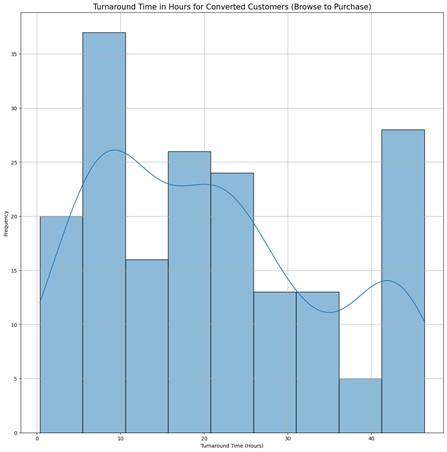
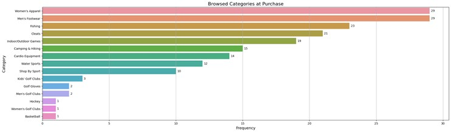
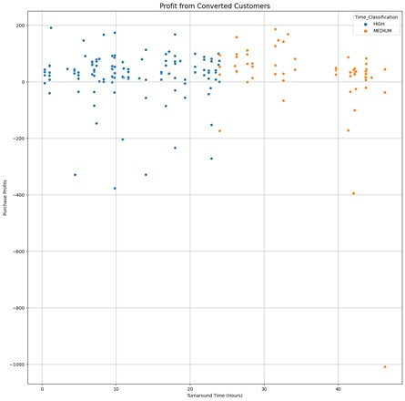

# 📘 Technical Summary: Geo-Temporal Fuzzy Merge ETL

This document serves as a quick-reference guide to the methodology, ETL pipeline stages, and core technical terminology employed in the **Geo-Temporal Customer Behavior ETL** project.

## 1. ETL Pipeline Methodology

The project's success hinges on overcoming data ambiguity through a multi-stage transformation process:

### A. Core Stages

The transformation process uses precise aggregation and spatial indexing to produce a clean Fact Table:

| Stage | Goal | Key Technique |
| :--- | :--- | :--- |
| **Geocoding** | Standardize location strings into quantitative coordinates. | Geopy (Nominatim/IP-API) |
| **Session Aggregation** | Compress high-volume clickstream into single, analyzable sessions ($\mathbf{T_0}$). | `MIN(Timestamp)` and `AVERAGE(Lat/Lon)` |
| **Fuzzy Merge (Linking)** | Infer a high-confidence link between browsing and purchase events ($\mathbf{T_1}$). | **KD-Tree Indexing** & **Haversine Distance** |

### B. Analytical Validation

The small, linked cohort demonstrates unique behavioral characteristics, confirming the success of the rigorous filtering process.

* **Validation:** The **Minimum Turnaround Time Observed** was $\mathbf{22 \text{ hours}}$.

* **Behavioral Skew:** Comparison of purchase habits shows a strong correlation between traceable, multi-session research and higher-margin goods.

* **Profit per conversion:** Visualisation of the profits brought in for every sale of the converted customer, which shows a mostly profitable income, with some determined shoppers who only waited for deep-discounts on preferred products.

---

## 2. Key Analytical Metrics

| Metric | Calculation/Definition | Application |
| :--- | :--- | :--- |
| **Attributable Turnaround Time** | $\mathbf{T_{\text{purchase}} - T_{\text{browse}}}$ (Purchase Date - First View Timestamp in hours/minutes). | Quantifies the customer deliberation cycle. |
| **Link Confidence** | Categorical feature ($\text{HIGH/MEDIUM/FOCUSED}$). | Used to select the most reliable cohort for predictive modeling. |

## 3. Appendix of Technical Terms

| Term | Definition |
| :--- | :--- |
| **KD-Tree** | A space-partitioning data structure (SciPy) used for highly efficient nearest-neighbor searches in the spatial merge. |
| **Haversine Distance** | A formula used for accurate great-circle distance calculation between two Latitude/Longitude points on Earth, crucial for the $\le 5 \text{ km}$ filter. |
| **Fuzzy Merge** | A join based on probabilistic similarity (time/location) rather than a direct primary key match. |
| **Parquet** | A columnar storage file format optimized for analytical query performance and compression, used for the final Fact Table. |

---
